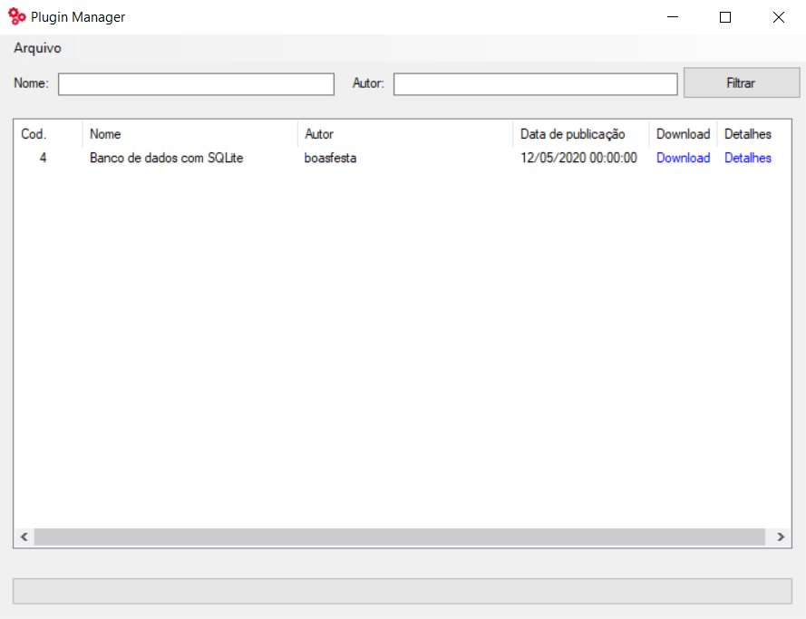
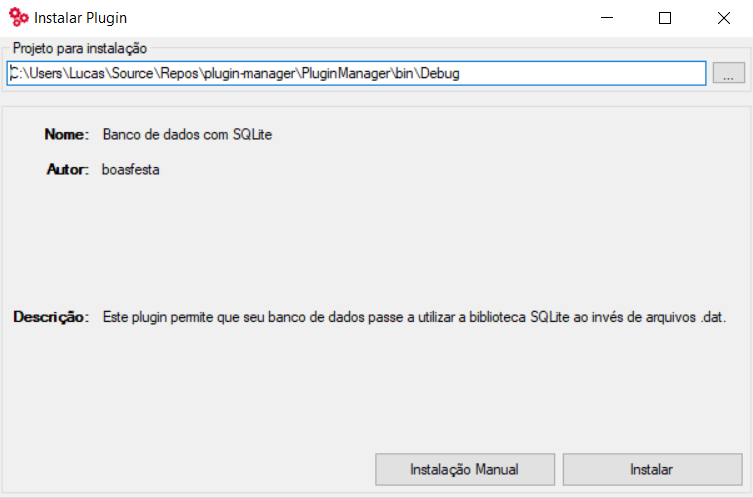
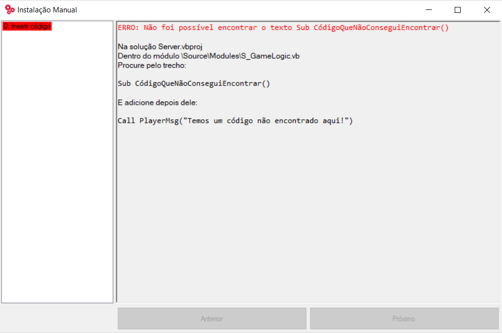
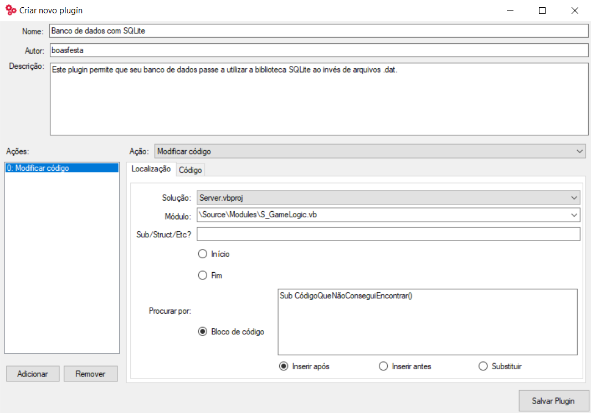
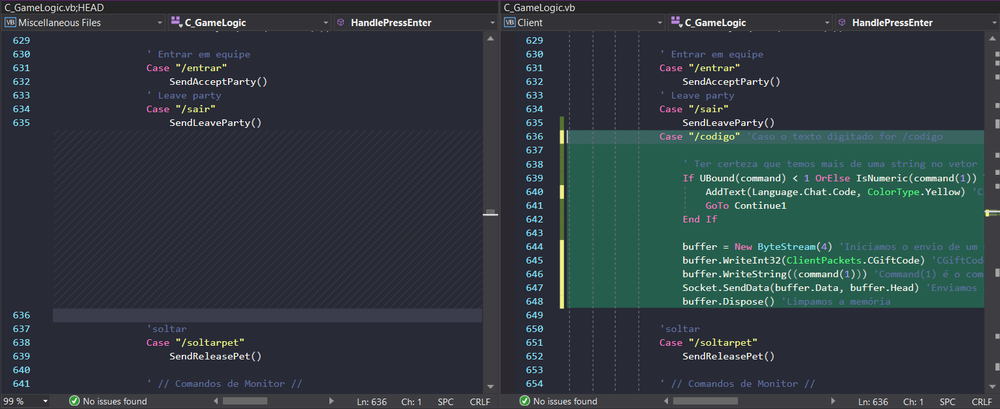

.. _plugin-manager:

Gerenciador de Plugins
==========================

O **Gerenciador de Plugins** ou **Plugin Manager** é um gerenciador capaz de instalar novas tecnologias na sua Elysium.NET de maneira automática. Sem a necessidade de tutoriais que acabam por requerir muito trabalho tanto do autor como o do usuário. A proposta do gerenciador é a capacidade de implementar modificações da Elysium.NET através de um simples clique.

Utilidades
#########################
* Criar plugins de forma dinâmica definindo a ação efetuada com cada bloco de código.
* Exibir e instalar plugins verificados e disponibilizados pela comunidade.
* Publicar plugins em prol de colaborar com a comunidade.
* Permitir uma instalação manual do plugin em forma de tutorial.

Como utilizar
#########################

Instalando o Plugin Manager
**********************
O Plugin Manager vem acompanhado de um instalador. Após a instalação, é possível abri-lo através do Menu Iniciar.

Instalando um novo Plugin
**********************
Os plugins verificados da comunidade são automaticamente listados na tela principal do Plugin Manager, permitindo o download e instalação dos mesmos a qualquer momento utilizando de um simples clique no botão "Download". Da mesma forma, qualquer plugin externo pode ser instalado através do menu **Arquivo -> Instalar** e selecionando o arquivo .plugin.

Para instalar o plugin, basta configurar a pasta destino do projeto na caixa de texto superior e clicar no botão "Instalar". Observando de que esta pasta é a pasta raiz de um projeto Elysium.NET, antes da pasta "Source".

**Alerta:** É altamente recomendável de que um backup do código seja feito antes de cada instalação e o Visual Studio se encontre fechado.

Lidando com possíveis erros
**********************
Alguns plugins podem ter problemas ao serem instalados em sua Elysium, principalmente em casos onde o desenvolvedor a modificou bastante e impediu o Plugin Manager de encontrar algum trecho de código específico. Neste caso, a instalação ressaltará o número de erros e permitirá que o usuário veja a lista de ações do plugin, destacando as ações falhas e seu respectivo problema. Atualmente, o usuário terá de seguir a orientação da ação manualmente para efetuar a correção.

Criando um novo Plugin
#########################
Os plugins trabalham de maneira similar a um autor escrevendo um tutorial. Instruções como "Procure por tal trecho de código e substitua-o por isso" ou "Encontre a função X e abaixo dela insira este trecho" são descritas de maneira automatizada pelo Plugin Manager como uma lista de ações.

A região esquerda contém a lista de ações do plugin, enquanto a região central direita descreve os dados da ação correspondente. A aba "Localização" permite que o usuário oriente onde a ação deverá atuar, informando a solução, classe, opcionalmente uma possível estrutura (como uma Structure, Sub, Function, etc...), ou até mesmo um bloco de código específico, e apenas neste ultimo caso, é possível selecionar se o seu código customizado será adicionado após o bloco em questão, antes ou o substituirá. A aba "Código" irá conter seu código customizado.

Recomendações
**********************
Antes de iniciar a criação do Plugin, é recomendável criar um repositório Git para facilitar a visualização de modificações no código. Como este trecho de código realçado em Verde que foi **adicionado**:

O repositório ajuda a exibir as modificações em blocos de códigos e de certa forma "traduz" as ações que devem ser feitas no Plugin Manager, como adicionar, remover ou substituir códigos.

Configurações de uma ação
**********************
* Aba **Localização**
* **Solução:** A solução em questão a ser modificada (Cliente, Servidor ou ambos).
* **Módulo:** Módulo da solução em questão (Caso a ação for **Criar novo módulo**, este é o módulo que será adicionado e a configuração acaba aqui).
* **Sub/Struct/Etc? (Opcional):** Caso a alteração seja especificamente em uma Sub, Struct, Function ou qualquer estrutura parecida, a mesma deve ser informada nesta linha, isso facilitará o Plugin Manager de encontrar a estrutura e tornará o plugin mais compatível (reduzindo problemas em Elysiums já modificadas ou com mais plugins). 

* **Procurar por:**
* **Início:** O código será aplicado no início do módulo (Ou estrutura caso algo seja informado em **Sub/Struct/Etc?**)
* **Fim:** O código será aplicado no fim do módulo (Ou estrutura caso algo seja informado em **Sub/Struct/Etc?**)
* **Bloco de código:** O código será aplicado **Após, antes ou substituirá** o bloco de código informado para pesquisa.

* Aba **Código**
* Código em questão a ser inserido/substituído na Elysium. É neste espaço que será inserido o **código do plugin**. No caso da ação **Criar novo módulo**, este campo deverá conter **todo o código do módulo**.

**Alerta:** É recomendável testar o plugin em uma Elysium.NET sem modificações para validar sua compatibilidade. O critério de validação dos plugins para a lista da comunidade utilizam de uma Elysium.NET limpa mais recente como teste, caso contrário, o plugin não será validado ao público.

Publicando um plugin
#########################
Após concluir o plugin, o usuário pode optar por compartilhá-lo com a comunidade da MMODEV. Para isso, o link https://www.plugins.mmodev.com.br/ é disponibilizado ao público para submeter seus respectivos plugins.

Recomendações para publicação
**********************
* Testar o Plugin instalando-o em uma Elysium original e limpa.
* Tomar cuidado com a identação do código, afinal o Plugin Manager não efetua identação automática e o plugin pode acabar por "sujar" o código dos usuários.
* Ser descritivo na funcionalidade do Plugin e tomar cuidado para não esquecer detalhes, os Administradores devem entender a utilidade e função do Plugin facilmente.
* Criar um tópico na categoria "Extensões" do fórum explicando sobre o Plugin, é extremamente aconselhável e evitará a rejeição do Plugin desnecessáriamente.
