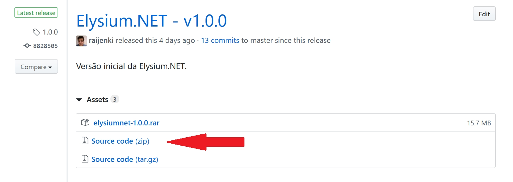
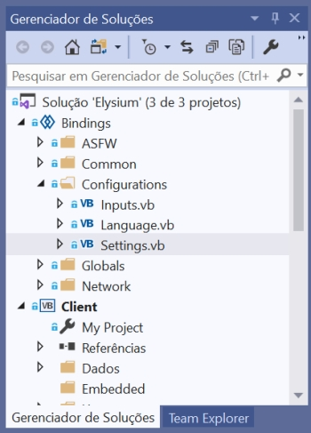
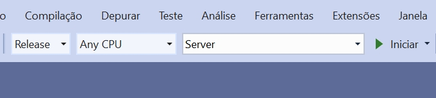

.. _compiling:

Compilando
==========================

O processo de compilação da Elysium.NET é importante para que se possa fazer a distribuição do seu jogo. Em suma, é transformar todo o código-fonte, escrito em Visual Basic.NET, em um executável do Windows.
No momento, algumas alterações, como o IP do Servidor, só podem ser realizadas através do processo de compilação, e isso é o que este guia vai ensinar.

Requisitos
#########################
Diferentemente de quando você necessita rodar a aplicação, a versão do .NET Framework necessária neste caso é o *Software Development Kit* (SDK), que inclui todas as bibliotecas necessárias para desenvolvimento na plataforma .NET. Além disso, também é necessário a utilização do Visual Studio, haja visto que é a interface de desenvolvimento utilizada pela MMODEV.

* O Visual Studio Community, cuja versão é gratuita, pode ter seu download realizado `aqui <https://visualstudio.microsoft.com/pt-br/vs/community/>`_.
* O .NET Framework pode ser baixado `aqui <https://dotnet.microsoft.com/download>`_. Certifique-se de estar instalando o 'Dev Pack' e a versão .Net Framework 4.0 ou superior.

Você pode optar por baixar o .NET Framework através do próprio instalador do Visual Studio, que está em português. Certifique-se de estar instalando as ferramentas de desenvolvimento em .NET (que incluirá C#, VB.NET e F#).

Pegando o Código-Fonte da Elysium.NET
###########################################
O código-fonte da Elysium.NET encontra-se no `GitHub <https://github.com/raijenki/elysium/releases>`_ de desenvolvimento. Escolha uma das versões lançadas e baixe o *Source Code*, indiferente do formato (.zip ou .tar.gz).

.. warning:: Usuários mais avançados podem se sentir mais a vontade para fazer cópia direta do repositório da Elysium.NET e ter acesso às novidades mais recentes; entretanto, ressalta-se que tais versões não são amplamente testadas e são bastante suscetíveis a bugs.

Estrutura do Diretório
###########################################
Ao descompactar os arquivos, esta é a estrutura de diretório-raiz do código-fonte da Elysium.NET:

* **docs:** A documentação do Sphinx, exatamente este texto que você está lendo.
* **packages:** Os pacotes de dependências; no momento, somente a SFML é dependência.
* **Source**: O codigo fonte da Elysium.NET como um todo.

Dentro da pasta Source, ha a seguinte estrutura:

* **Client:** Código exclusivo ao cliente, relativo principalmente a renderização gráfica e sonora.
* **Server**: Código exclusivo do servidor, como gerenciamento de contas e processamento de ações (danos, por exemplo).
* **Bindings:** Trata-se de código comum ao cliente e ao servidor, como criptografia, comunicação e acesso a diretórios.

Em especial, o cliente terá outros diretórios de formulários (Forms), que dizem respeito aos editores e a parte de renderização gráfica, e a parte lógica (Modules) do jogo em si.

Alterando Configurações
###########################################
O processo mais básico a se fazer é a alteração das configurações básicas e a geração de um executável. Com o Visual Studio, abra o arquivo **Elysium.sln**, que estará no diretório-raiz. Ao abrir, procure no gerenciador de soluções o caminho ``Bindings/Configurations/Settings.vb``.

	
Esse arquivo é o responsável por todas as configurações iniciais tanto do cliente quanto do servidor. Comece procurando por:
::
   
    <XmlIgnore()> Public Ip As String = "127.0.0.1"
    <XmlIgnore()> Public Port As Integer = 7001

    <XmlIgnore()> Public GameName As String = "Elysium.NET"
    <XmlIgnore()> Public Website As String = "http://www.mmodev.com.br"
	
A primeira linha será usada pelo cliente para procurar uma conexão pelo servidor, enquanto a segunda se refere à porta de conexão; o padrão é 7001, mas é possível alterá-la caso esteja bloqueiada por algum motivo. Se você não sabe seu IP, utilize sites como o WhatIsMyIp.com. ``GameName`` e ``Website`` são, respectivamente, o nome do jogo e o website.

Logo abaixo, também há configurações do servidor:
::

	Public GameName As String = "Elysium.NET"
    Public Website As String = "http://www.mmodev.com.br"

    Public Welcome As String = "Bem vindo ao Elysium.net, aproveite sua estadia e visite nosso portal http://www.mmodev.com.br!"
    Public Port As Integer = 7001

    Public StartMap As Integer = 1
    Public StartX As Integer = 13
    Public StartY As Integer = 7

Atente-se que os parâmetros ``GameName``, ``Website`` e ``Port`` devem ser iguais para o servidor e o cliente. O ``Welcome`` é a mensagem que o cliente irá mostrar ao conectar com o servidor, enquanto ``StartMap``, ``StartX`` e ``StartY`` se referem a localização que um novo personagem irá aparecer quando criando (respectivamente, mapa, posição X e posição Y).

Compilando
#######################
Com as modificações realizadas, atente-se em mudar os parâmetros do cliente e do servidor para o modo ``Release``. Isso porque o modo ``Debug`` emite muitas informações desnecessárias ao servidor, servindo mais para procurar bugs do sistema e afins.

	
Feito isso, acesse o menu ``Compilação`` e escolha a opção ``Compilar Solução``. Automaticamente, o diretório ``Build`` será criado no diretório-raiz, com as pastas Cliente e Servidor. 

A partir daí, você já pode zipar a pasta do cliente e distribuir para os jogadores. Caso tenha um servidor anterior, faça a migração de toda a pasta ``Database`` para o novo servidor.