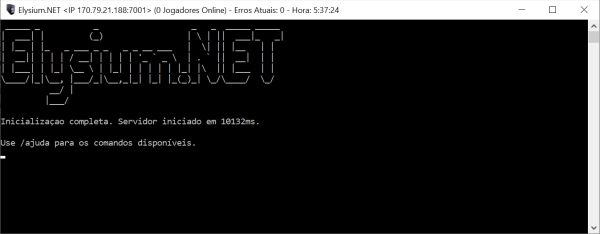
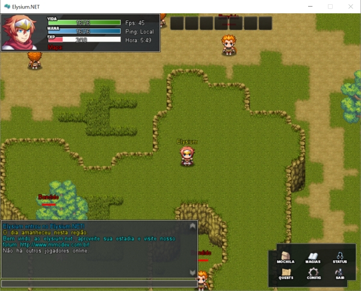

.. _install:

Instalando
==========================

Fazer seu primeiro jogo com a Elysium.NET é muito fácil, e deve levar alguns poucos minutos. Entretanto, este tutorial também irá discutir alguns detalhes mais técnicos para aprofundar a compreensão do desenvolvedor.

Requisitos
#########################
É muito provável que você já tenha instalado o .NET Framework no seu Windows, em virtude de ser amplamente utilizado por outras aplicações. Caso não o possua, faça o download no `website da Microsoft <https://www.microsoft.com/pt-br/download/details.aspx?id=56116>`_. Certifique-se que a versão do mesmo é 4.0 ou superior.

Baixando a versão mais recente
####################################
O primeiro passo envolve baixar a versão mais recente, costumeiramente chamada de latest, e pode ser encontrada `aqui <http://www.mmodev.com.br/downloads/elysium-latest.rar>`_.
Para extrair os arquivos, você precisará de uma aplicação como o WinRAR ou o 7-zip.

Estrutura dos Diretórios
####################################
A versão baixada contém apenas os arquivos executáveis, sem o código fonte. Isso limita um pouco o que pode ser feito com a Elysium.NET, apesar de que todos os parâmetros de jogos (como mapas, classes, habilidades) podem ser alterados.
Ao descompactar, existem duas pastas no diretório-raiz:

* **Server**: Possui os arquivos do servidor, responsável por gerenciar todo o banco de dados do jogo, como contas, mapas, NPCs, etc.
* **Client**: É o jogo em si, contendo os arquivos gráficos, sons e a lógica de comandos a serem enviadas para o servidor processar.

Inicializando o Servidor
####################################
Na versão latest da MMODEV, o servidor sempre vem com um mapa exemplo, com NPCs e a conta padrão de login **mmodev** e senha **mmodev**.
Inicialize o servidor e espere o carregamento completo de todas as telas, onde ele mostrará a logo da Elysium.NET.

	
A partir deste momento, o cliente conseguirá detectar o servidor e conectar a ele. Você pode usar o comando ``/ajuda`` na própria tela do servidor para obter uma lista de comandos que podem ser usados.

.. warning:: Por questão de segurança, delete o arquivo **AsyncKeys.xml** antes de inicializar o servidor. Ele contém uma chave criptografica que serve de comunicação entre o servidor e o cliente e, por ser padrão na versão compilada, outras pessoas podem conseguir hackear seu jogo se não trocada. Ao deletar, o servidor cria, em sua inicialização uma chave nova, a qual pode servir para a distribuição do seu jogo.

Trabalhando com o Cliente
####################################
Com o servidor preparado, você pode abrir o arquivo **Elysium Cliente.exe** e esperar que o estado do servidor fique Online. A partir daí, crie uma nova conta ou faça o login com a conta padrão de login **mmodev** e senha **mmodev**.

Caso você opte por criar uma conta própria, utilize o comando ``/setadmin NOME-DO-PERSONAGEM 4`` na tela do servidor para dar o máximo de poder de administração ao personagem.

	
Os comandos mais básicos do cliente são:

* W-A-S-D: Movimento para cima, baixo, esquerda e direita.
* CTRL: Interage com o mapa e/ou ataca os imigos.
* INSERT: Abre o painel de administração.

Com o painel de administração aberto, a criação do mundo fica mais intuitiva e é atualizada em tempo real. Para mais informações, verifique a página correspondente de cada sistema.

Distribuindo seu jogo
####################################
No momento, a única maneira de distribuir seu jogo é compilando-o e alterando o IP do servidor dentro do código. Isso está para ser alterado nas próximas versões.

Repare que, mesmo você criando uma versão do zero, é possível copiar o diretório do servidor antigo para o novo, preservando o conteudo de mapas, contas e habilidades.